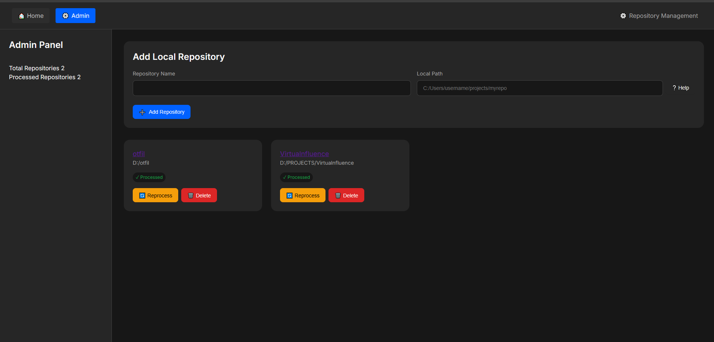

# 👻 Ghost in the Code

A smart AI assistant that helps you explore and understand code through natural conversations.

## 📸 Screenshots

### Home Page - Chat with Your Code


### Repository Details and History


### Admin Panel - Manage Repositories


## 🌟 Key Features

- 💬 Chat with your code using natural language
- 🔍 Smart search across multiple repositories
- 📁 File explorer with syntax highlighting
- 🔄 Git integration
- ⚡ Real-time responses
- 🎨 Modern dark theme

## 🚀 Quick Start

### Requirements

- Python 3.8+
- Git
- [Ollama](https://ollama.ai/) with Mistral model
- On Windows: [Microsoft C++ Build Tools](https://visualstudio.microsoft.com/visual-cpp-build-tools/) for installing packages like chroma-hnswlib

### Setup

1. Clone and install:
```bash
git clone https://github.com/Omersut/ghost-in-the-code.git
cd ghost-in-the-code
python -m pip install --upgrade pip
pip install -r requirements.txt
```

2. Start Ollama:
```bash
ollama serve
ollama pull mistral
```

3. Run the app:
```bash
python -m uvicorn main:app --reload
```

4. Open `http://localhost:8000` in your browser

### Add Your Local Repository

Create `repos.yaml` in the project root:
```yaml
repositories:
  - name: my-project
    local_path: "D:/Projects/my-project"  # Your local project path
```

You can also add repositories through the Admin panel:
1. Click on "Admin" in the navigation bar
2. Click "Add Local Repository"
3. Enter the repository name and local path
4. Click "Add Repository"

## 🔧 Tech Stack

- Backend: FastAPI, ChromaDB, Sentence Transformers
- LLM: Ollama (Mistral)
- Frontend: JavaScript, Modern CSS

## 📝 License

MIT License - see [LICENSE](LICENSE) file

## 🔗 Links

- [GitHub Repository](https://github.com/Omersut/ghost-in-the-code)
- [Report Issues](https://github.com/Omersut/ghost-in-the-code/issues)

## ❓ Troubleshooting

1. **Ollama Issues**
   - Make sure Ollama is running (`ollama serve`)
   - Check if Mistral is installed (`ollama list`)

2. **Repository Issues**
   - Make sure the local path exists
   - Check folder permissions
   - Ensure the path is correctly formatted
